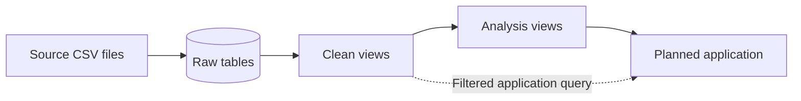
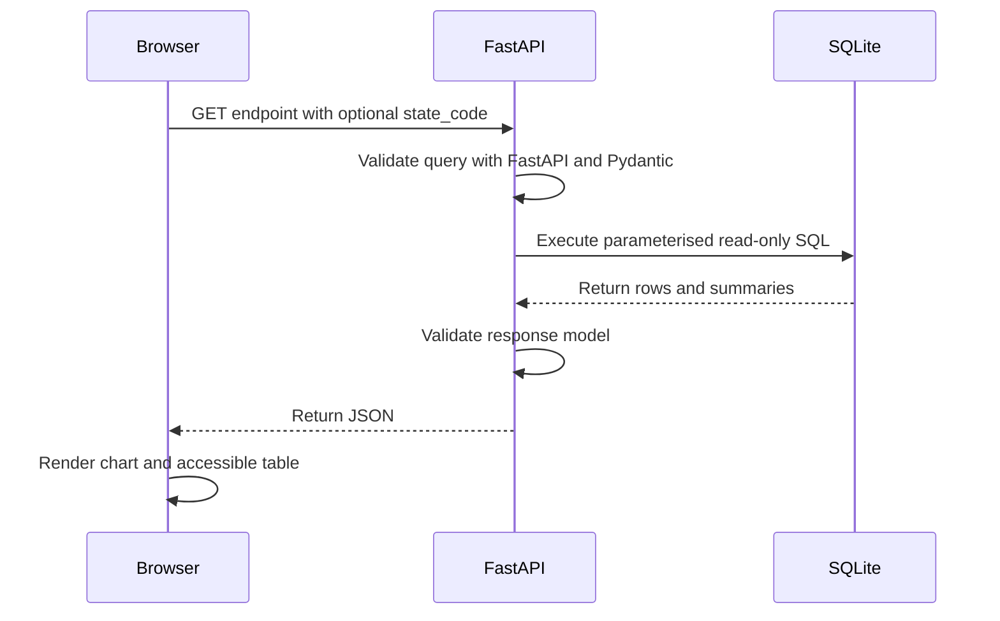

# TVET participation and pay

An independent visualisation project using Khazanah Research Institute's School-to-Work Transition Survey (SWTS). The project follows the data from its original public files, through analysis and a SQLite data layer, to an interactive web app.

**[Open the live interactive visualisation](https://swts-app.onrender.com/)**

[Explore the FastAPI documentation](https://swts-app.onrender.com/docs) · [Check service health](https://swts-app.onrender.com/health)

The public demo runs on Render's free tier, so the first visit after a period of inactivity may take up to a minute to load.

## Project initiation

The aim is to build a web app that fetches data from a database, visualises it and allows the result to be filtered. The project started with the evidence rather than a predetermined chart: find a suitable Malaysian dataset, understand what has already been analysed, and then decide what should be visualised.

KRI's [School-to-Work Transition Survey](https://www.krinstitute.org/publications/the-school-to-work-transition-survey-swts-of-young-malaysian) was selected because the respondent-level CSV files, supporting documents and published report are publicly available. The report's discussion of technical and vocational education and training (TVET) led to two questions:

1. How are school pathways distributed within different ethnic groups?
2. What maximum salaries do employers report offering across qualification routes?

Those questions narrow the project to the in-school and employer survey modules. The rest of the workflow follows from that choice: understand the raw files, reproduce the relevant summaries in a notebook, make the data queryable in SQLite, and expose it to the web app.

## Project structure

```text
KRI-app/
|-- raw_data/               # 1. Original CSVs, metadata and source report
|-- notebooks/              # 2. Analysis notebook and PNG/SVG exports
|-- database/               # 3. SQLite builder, SQL and generated database
|-- webapp/                 # 4. FastAPI backend, API contract and frontend
|-- requirements.txt
`-- .venv/                  # Local Python environment; excluded from Git
```

## 1. Raw data

### Source files and scope

The survey is released as CSV rather than as a queryable database. The project retains the two modules required for the visuals:

| File | Records | Columns | Role |
| --- | ---: | ---: | --- |
| [`SWTS_InSchool.csv`](raw_data/SWTS_InSchool.csv) | 7,026 | 72 | School-pathway distribution within each ethnic group |
| [`SWTS_Employer.csv`](raw_data/SWTS_Employer.csv) | 1,620 | 109 | Maximum salary offers by qualification for the selected employer group |

The original CSVs are preserved without modification. They are not reconstructed from the report's tables or percentages, and no derived CSV files are created. Their official download links, attribution, licence, dimensions and survey context are recorded in the [source provenance](raw_data/PROVENANCE.md).

### The report as context

The CSV files contain records and category codes, but they do not explain why these two views are useful. That context comes from KRI's 2018 report, [*The School-to-Work Transition of Young Malaysians*](https://www.krinstitute.org/file/20181205-swts-main-book). A local copy is retained at [`raw_data/report/20181205_SWTS_Main_Book.pdf`](raw_data/report/20181205_SWTS_Main_Book.pdf).

Two report locations guide the project:

- **Chart 2.3 and printed page 28:** weighted TVET participation by ethnicity. The first visual instead calculates the complete unweighted school-pathway distribution from the released in-school records.
- **Table 6.7 and printed page 239:** public-sector maximum salary offers by qualification. The second visual shows individual valid responses and unweighted summaries for records where `A1 = 3`.

[`section_evidence.json`](raw_data/report/section_evidence.json) records these claims, their printed pages, reported values and relationship to the visuals in a form the notebook can read. It is an evidence inventory compiled from the report, not a new calculation. The report is used for context and is not parsed when the notebook or app runs.

### Metadata and field interpretation

KRI's dataset page supplies column definitions and links to the coding manual and survey instruments. The retained [`source_column_definitions.json`](raw_data/metadata/source_column_definitions.json) contains the published definitions for the two selected modules and a local file inventory. This metadata was extracted from KRI's website on **2 October 2026**.

Numeric category codes are labels, not measured quantities. Blank fields and the literal `#NULL!` are handled field by field and are never automatically replaced with zero. Comparing the CSVs, coding manual and questionnaires also shows that instrument versions and exported codes do not always align.

For the school-pathway visual, ethnicity codes follow the coding manual:

| `ethnic` code | Interpretation used |
| --- | --- |
| `1`–`2` | Bumiputera: Malay and Other Bumiputera combined |
| `3` | Chinese |
| `4` | Indian |
| `5` | Other |

Detailed `SchoolType1` values are collapsed into the four pathway families used in report Chart 2.3:

| `SchoolType1` codes | Pathway family |
| --- | --- |
| `1`–`6` | National / residential / Form 6 |
| `7` | Technical / vocational |
| `8`–`9` | National religious |
| `10`–`11` | International / private |

For the salary visual, four maximum monthly offer fields are reshaped into qualification categories:

| CSV field | Qualification label |
| --- | --- |
| `C5d_schoollever_maximum` | School leaver / low-skilled |
| `C5c_college_maximum` | Vocational / technical college |
| `C5a_undergraduate_maximum` | University undergraduate |
| `C5b_postgraduate_maximum` | University postgraduate |

The salary visual selects the 405 employer records where `A1 = 3`. The published coding manual and employer questionnaire label that code public sector/government agency, but the released CSV contains additional `A1` codes that are absent from the earlier instruments. The label is therefore presented as a questionnaire label whose mapping to the CSV export remains unconfirmed.

### Analytical boundary

KRI used probability sampling and survey weights for its published in-school and employer estimates. No identifiable weight field exists in either released CSV. This project therefore reports unweighted sample counts and summaries; it does not claim to reproduce the report's population estimates.

The two modules are also separate samples. In-school respondents cannot be linked to the surveyed employers, and the salary fields describe reported offers rather than realised earnings or causal returns to a qualification.

## 2. Notebook analysis

Once the source fields and coding limitations are understood, the next step is to check that the raw records can support the two questions. [`tvet_pathway.ipynb`](notebooks/tvet_pathway.ipynb) provides that analytical bridge. It reads the original CSVs directly, applies the documented mappings and displays the intermediate counts before drawing either chart.

The notebook begins with the report evidence inventory, checks the dimensions and headers of both source files, and then produces two independent views of the survey.

### School pathways by ethnicity

The first visual uses all 7,026 records in `SWTS_InSchool.csv`. It combines Malay and Other Bumiputera respondents, groups the detailed school types into four pathway families, and calculates the distribution of those pathways within each ethnic group.

The chart shows the complete distribution rather than plotting only the report's TVET percentages. TVET counts and shares are labelled alongside each group so the particularly small Chinese and Other subsamples remain visible.

### Maximum salary offers by qualification

The second visual selects the 405 employer records where `A1 = 3` and reshapes the four maximum-offer fields into qualification categories. Blank and `#NULL!` responses are excluded separately for each qualification.

Each dot represents one valid employer response. The chart also reports the unweighted mean, median, minimum, maximum and valid response count for each qualification. These are maximum monthly offers reported by employers, not observed earnings or guaranteed starting salaries. The questionnaire's public-sector label is shown with the unresolved CSV-mapping caveat.

### Run the notebook

On a new computer, install Python 3.12 and create the shared project environment from the repository root:

```powershell
py -3.12 -m venv .venv
.\.venv\Scripts\python.exe -m pip install -r requirements.txt
.\.venv\Scripts\python.exe -m ipykernel install --user --name kri-app --display-name "KRI-app (.venv)"
```

On macOS or Linux, use `python3`, `.venv/bin/python` and the corresponding activation commands instead.

Open [`tvet_pathway.ipynb`](notebooks/tvet_pathway.ipynb), select **KRI-app (.venv)** and choose **Run All**. The notebook can be started from the repository root or the `notebooks/` directory and runs offline once the dependencies are installed.

The figures are exported in both review and web-friendly formats:

```text
notebooks/outputs/
|-- 01_school_pathways_by_ethnicity.png
|-- 01_school_pathways_by_ethnicity.svg
|-- 02_salary_offers_a1_3.png
`-- 02_salary_offers_a1_3.svg
```

Both calculations remain unweighted because the released files contain no identifiable survey-weight field. They describe the recovered samples, do not reproduce KRI's population estimates and do not establish why the observed differences occur.

## 3. Database

The notebook proves that the calculations work, but a notebook is not a practical data source for an application. The app needs a consistent way to request records, apply filters and receive the same shaped result each time. Reading and transforming both CSV files for every request would repeat analytical logic and couple the app directly to the source format.

SQLite provides the intermediary data layer. It keeps the relational structure of the CSV files, supports SQL queries and produces one local database file without requiring a separate database server. The file is generated from the preserved sources rather than edited or committed by hand.

### Data model

The model separates storage, interpretation and aggregation:



Each layer has one responsibility:

| Layer | Database objects | Responsibility |
| --- | --- | --- |
| Raw | `raw_in_school`, `raw_employer` | Preserve every CSV row and value without analytical recoding |
| Clean | `clean_in_school`, `clean_salary_offers` | Assign useful types, handle missing values, apply documented labels and reshape fields |
| Analysis | `analysis_school_pathways_by_ethnicity`, `analysis_salary_offers_a1_3` | Provide the aggregated results required by the two known visualisations |

The two survey modules remain separate throughout the model. There is no respondent-level relationship between an in-school record and an employer record, so the database does not join them.

### Tables and views

A table stores rows inside the database file. The two raw tables contain the imported CSV data and a one-based `_source_row_number` that traces a database record back to its position in the source file. Source columns are initially stored as `TEXT`, which prevents the import from silently changing codes, blanks or `#NULL!` values.

A view is different: it stores a named `SELECT` query rather than another copy of the rows. It can be queried like a table, but SQLite evaluates its definition against the underlying tables at query time. In this project the views are logically built on top of the raw tables, although they remain separate database objects:

```text
SQLite database
|-- Tables
|   |-- raw_in_school
|   `-- raw_employer
`-- Views
    |-- clean_in_school
    |-- clean_salary_offers
    |-- analysis_school_pathways_by_ethnicity
    `-- analysis_salary_offers_a1_3
```

Views keep the raw import unchanged while making each interpretation visible in SQL. A correction to a mapping can therefore be reviewed in one place and applied consistently to every later query.

### Why clean views come first

The clean views remain at respondent or employer level so they can be reused by more than one aggregation.

- `clean_in_school` exposes integer state, ethnicity and school-type codes and applies the ethnicity and pathway mappings established during notebook analysis. Its grain remains one in-school response per row.
- `clean_salary_offers` converts the employer and state codes to integers, turns blank and `#NULL!` offers into SQL `NULL`, and reshapes four salary columns into four qualification rows per employer. This longer shape makes qualification grouping and filtering straightforward.

Both clean views retain `state_code`. This is deliberate: the planned app can filter the row-level view first and then calculate percentages or salary summaries using the selected state's records. Filtering an already aggregated all-state result would give the wrong denominator.

### Why analysis views are separate

The analysis views describe the two initially known, unfiltered chart datasets. They provide a stable boundary for a first version of the application and keep chart calculations out of presentation code.

- `analysis_school_pathways_by_ethnicity` returns one row for every ethnicity and pathway combination, including zero-count combinations. It supplies the count, ethnicity-group denominator and within-group sample share.
- `analysis_salary_offers_a1_3` selects employer code `A1 = 3` and returns the valid response count, unweighted mean, median, minimum and maximum for each qualification.

These views mirror the notebook results, but they do not contain parameters. If the future app needs a state filter, it can query the clean views with a `state_code` parameter and perform the same aggregations after filtering. The clean and analysis layers therefore serve different purposes: reusable row-level interpretation and chart-specific summarisation.

### SQL definitions

The view definitions are manually maintained, version-controlled SQL files; they are not generated by Python:

| File | Creates |
| --- | --- |
| [`001_clean_views.sql`](database/sql/001_clean_views.sql) | The two reusable clean views |
| [`002_analysis_views.sql`](database/sql/002_analysis_views.sql) | The two unfiltered chart-summary views |

The raw-table definitions are the exception. Because the two CSV exports contain 181 source columns in total, `build_database.py` reads each header and generates a matching raw table whose source fields are all `TEXT`.

### Build process

[`build_database.py`](database/build_database.py) performs the complete build:

1. Create a temporary SQLite database.
2. Read each CSV header and create its raw table.
3. Insert every CSV row, preserving blanks and source text.
4. Execute `001_clean_views.sql` and `002_analysis_views.sql` in order.
5. Close the completed database and replace the previous generated file.

Run it from the repository root:

```powershell
.\.venv\Scripts\python.exe database\build_database.py
```

This creates `database/build/kri.sqlite`, which is excluded from Git because it can always be rebuilt from the source files and SQL definitions. To write the database elsewhere, pass `--output PATH`.

The generated database should not be edited manually. Changes belong in `build_database.py` or a numbered SQL file, followed by a rebuild. Editing a `.sql` file without rebuilding will not update the view definition already stored inside `kri.sqlite`.

## 4. Visualisation app

With a queryable data layer in place, the final stage connects the two established visualisations to a web interface. The application does not introduce a new analysis. It presents the notebook results through database-backed endpoints and allows the user to recalculate them for a selected state.

State is used because it is a common field in both source modules. The same selected code can therefore be applied independently to the in-school and employer samples. This provides a useful regional lens, but it does not compare state performance: the results remain unweighted, the state sample sizes vary, and the two surveys cannot be linked to each other.

### Application structure

The app uses FastAPI for the backend and plain HTML, CSS and JavaScript for the frontend. Both are served by the same process:



[`webapp/main.py`](webapp/main.py) owns the response models, database connection and routes. Each data request receives its own read-only SQLite connection. Query values are passed separately from the SQL text, and a missing generated database returns a clear HTTP `503` response rather than silently building or modifying data.

[`webapp/run.py`](webapp/run.py) starts the local Uvicorn server. The frontend assets in [`webapp/frontend/`](webapp/frontend/) are served at `/static`, while `/` returns the visualisation page.

### API endpoints

The API boundary is deliberately small:

| Endpoint | Purpose |
| --- | --- |
| `GET /` | Serve the visualisation page |
| `GET /api` | Return links to Swagger and the OpenAPI schema |
| `GET /health` | Confirm that the generated SQLite database is readable |
| `GET /api/v1/states` | Return the 16 verified SWTS state codes and labels |
| `GET /api/v1/school-pathways` | Return the complete ethnicity-by-pathway dataset |
| `GET /api/v1/salary-offers` | Return individual salary offers and qualification summaries |

Both visualisation endpoints accept an optional `state_code` from 1 to 16. Omitting it returns all states. FastAPI rejects values outside that range with HTTP `422` before a database query runs.

For school pathways, the backend filters `clean_in_school` first, then builds the complete four-by-four ethnicity and pathway matrix. Counts, group denominators and shares are recalculated for the selection, including explicit zero-count combinations.

For salary offers, the backend applies the same state code independently to `clean_salary_offers`. It returns the selected employer count, every valid individual maximum offer, and a separate count, mean, median, minimum and maximum for each qualification. A state with no selected employer evidence returns empty arrays rather than invented zero salaries.

### API contract

Pydantic models provide the handshake between the database query and the frontend. They define the field names and types, constrain values such as percentages and state codes, and validate each response before FastAPI serialises it to JSON. FastAPI uses the same route annotations and response models to generate Swagger and the OpenAPI schema automatically.

The response also carries context the interface should not have to guess, including the selected state label, weighting status, currency and period, employer code, and the unresolved status of the questionnaire label. Array order is explicit so the frontend does not depend on alphabetical sorting.

The complete field-level expectations, missing-value behaviour and chart joining rules are retained in the versioned [frontend API contract](webapp/API_CONTRACT.md).

### Frontend behaviour

The frontend has no Node build step and no chart-library dependency. It first requests the state labels, then loads the school and salary endpoints in parallel. Selecting another state sends the same code to both endpoints and redraws each chart from its independently filtered response.

The school visual uses responsive stacked bars. The salary visual uses an SVG dot plot with individual observations, mean diamonds and median markers. Both include loading and error states, text descriptions for assistive technology, methodological caveats and expandable data tables. Missing evidence is displayed as unavailable rather than as a zero result.

### Run the app

Build the database if it does not already exist, then start the application from the repository root:

```powershell
.\.venv\Scripts\python.exe database\build_database.py
.\.venv\Scripts\python.exe webapp\run.py --reload
```

Open the local services at:

| URL | Use |
| --- | --- |
| <http://127.0.0.1:8000> | Interactive visualisations |
| <http://127.0.0.1:8000/docs> | Swagger UI and executable endpoint documentation |
| <http://127.0.0.1:8000/openapi.json> | Machine-readable OpenAPI schema |

On macOS or Linux, replace `.\.venv\Scripts\python.exe` with `.venv/bin/python`.

## Attribution

Data and report: Khazanah Research Institute (2018), *The School-to-Work Transition of Young Malaysians*. Licensed under CC BY 3.0. This is an independent project and not an official KRI publication or website.
