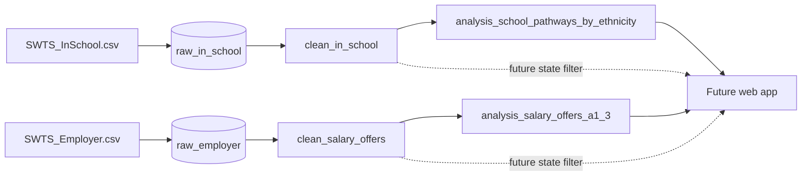

# Data model

This document defines the database model before describing how it is built.
The model supports the two existing notebook visuals while preserving enough
source detail for later filtering and analysis.

## Design goals

The database should:

1. preserve the two source CSVs without changing their values;
2. separate source storage from interpretation and aggregation;
3. reproduce the datasets required by the notebook visuals;
4. retain state and category codes for future filtering;
5. keep analytical definitions in reviewable SQL; and
6. remain rebuildable rather than requiring manual database edits.

SQLite is appropriate for this stage because the source data is small, the app
will initially be read-only, and a single local file is easy to reproduce and
deploy. The model can later be moved to another relational database without
changing its raw, clean and analysis boundaries.

## Model overview

The layers have different responsibilities:

| Layer | Responsibility |
| --- | --- |
| Source | Original CSV files retained in `raw_data/`. |
| Raw | Lossless row-level copies of the CSVs. |
| Clean | Typed, labelled, analysis-ready row-level views. |
| Analysis | Aggregated views for the current visualisations. |
| Application | Reads stable views; does not reinterpret raw survey codes. |

## Entity and view catalogue

### `raw_in_school`

Grain: one in-school survey response per row.

Key: `_source_row_number`, the one-based position of the record after the CSV
header. Every source column is imported using its original name and stored as
`TEXT`. In particular, blanks and the literal `#NULL!` remain source values at
this layer.

Fields currently used downstream are:

| Field | Use |
| --- | --- |
| `state` | Preserved for a future state filter. |
| `ethnic` | Source ethnicity code. |
| `SchoolType1` | Source school-type code. |

The remaining fields are retained for traceability and future analysis but are
not yet interpreted.

### `raw_employer`

Grain: one employer survey response per row.

Key: `_source_row_number`. As with `raw_in_school`, every CSV column is stored
under its original name as `TEXT`.

Fields currently used downstream are:

| Field | Use |
| --- | --- |
| `state` | Preserved for a future state filter. |
| `A1` | Employer-type code. |
| `C5d_schoollever_maximum` | Maximum school-leaver or low-skilled offer. |
| `C5c_college_maximum` | Maximum vocational or technical-college offer. |
| `C5a_undergraduate_maximum` | Maximum undergraduate offer. |
| `C5b_postgraduate_maximum` | Maximum postgraduate offer. |

### `clean_in_school`

Grain: one in-school response per row.

Key: `respondent_id`, inherited from `raw_in_school._source_row_number`.

| Column | Meaning |
| --- | --- |
| `respondent_id` | Stable link back to the raw row. |
| `state_code` | Integer form of the source state code. |
| `ethnicity_code` | Integer source code. |
| `school_type_code` | Integer source code. |
| `ethnicity_group` | Display grouping used by the notebook. |
| `school_pathway` | Four-category pathway grouping used by the notebook. |

This is a view rather than a table: raw data remains unchanged and the code
mappings have one visible SQL definition.

### `clean_salary_offers`

Grain: one employer, qualification and maximum-offer combination per row.
Each raw employer can therefore produce four rows.

Candidate key: (`employer_id`, `qualification_order`).

| Column | Meaning |
| --- | --- |
| `employer_id` | Link back to `raw_employer._source_row_number`. |
| `state_code` | Integer form of the source state code. |
| `employer_type_code` | Integer form of `A1`. |
| `qualification_order` | Stable visual ordering from 1 to 4. |
| `qualification` | Human-readable qualification category. |
| `maximum_offer_rm` | Maximum monthly offer as `REAL`; blank and `#NULL!` values become SQL `NULL`. |

Reshaping the four salary columns into rows makes grouping, filtering and chart
queries simpler.

### `analysis_school_pathways_by_ethnicity`

Grain: one ethnicity group and school pathway combination. The view always
returns a complete 4 by 4 matrix, including zero-count combinations.

Candidate key: (`ethnicity_group`, `school_pathway`).

| Measure | Definition |
| --- | --- |
| `respondents` | Unweighted count in the combination. |
| `ethnicity_respondents` | Unweighted total for the ethnicity group. |
| `sample_share_percent` | `respondents / ethnicity_respondents * 100`. |

`ethnicity_order` and `pathway_order` provide deterministic chart ordering.

### `analysis_salary_offers_a1_3`

Grain: one qualification for employer records where `A1 = 3`.

Key: `qualification_order`.

The measures are valid response count, unweighted mean, median, minimum and
maximum of `maximum_offer_rm`. The view name uses the source code because the
questionnaire's public-sector label is not confirmed for the CSV export.

## Code mappings

The model uses the mappings already established for the notebook.

| Source `ethnic` code | `ethnicity_group` |
| --- | --- |
| 1-2 | Bumiputera |
| 3 | Chinese |
| 4 | Indian |
| 5 | Other |

| Source `SchoolType1` code | `school_pathway` |
| --- | --- |
| 1-6 | National / residential / Form 6 |
| 7 | Technical / vocational |
| 8-9 | National religious |
| 10-11 | International / private |

These are analytical groupings, not modifications to the corresponding raw
fields.

## Application contract

The first web-app version should read the two `analysis_*` views. This keeps
the UI concerned with presentation rather than survey-code interpretation.

For a future state filter, the query order should be:

1. select a `clean_*` view;
2. filter by `state_code`;
3. calculate the same grouping and measures as the relevant analysis view; and
4. return the result to the visualisation.

Once state-filtered queries are settled, they can become parameterised
application queries or additional SQL views. State labels should not be added
until their source mapping has been verified and documented.

## Known boundaries

- The released files do not contain an identifiable survey-weight field, so
  all measures are unweighted sample summaries.
- `_source_row_number` identifies a row within the current file; it is not a
  survey-issued respondent identifier.
- Raw columns are intentionally stored as text. Types are assigned only where
  a field is used by a clean view.
- The two survey modules are separate respondent populations and are not
  joined to each other.
- Employer code `A1 = 3` is kept as a code because its export-specific label is
  unresolved.
